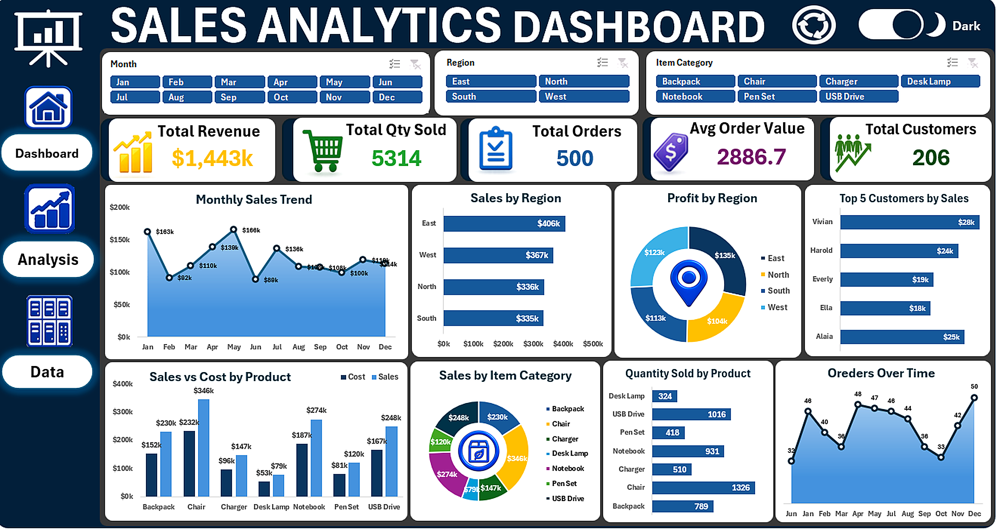
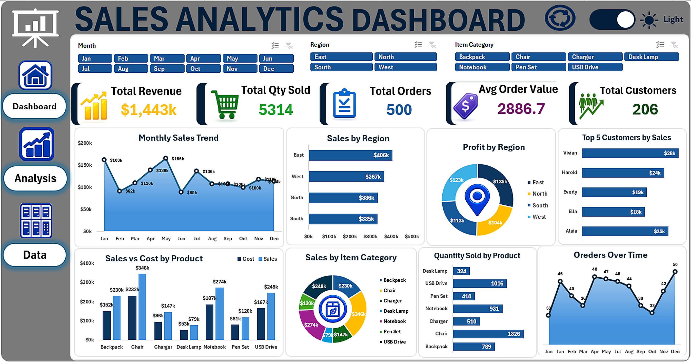

# 📊 Sales Analytics Dashboard | Microsoft Excel

An interactive **Sales Analytics Dashboard** built entirely with **Microsoft Excel**, designed to transform raw sales data into clear, meaningful, and actionable business insights.

## 🚀 Project Overview

This project analyzes sales data to provide a comprehensive view of business performance across different dimensions, including sales, costs, profits, regions, products, categories, and customers.

The dashboard is designed to make complex data easier to understand and support **data-driven decision-making**.

## 📌 Dashboard Features

* 📈 Interactive KPI Dashboard
* 💰 Sales, Cost & Profit Analysis
* 🌍 Regional Performance Analysis
* 📦 Product & Category Analysis
* 👥 Customer Sales Analysis
* 📅 Monthly Sales Trends
* 🎛️ Interactive Slicers for Dynamic Filtering
* 🌙 Light & Dark Mode
* ⚙️ VBA Automation

## 📊 Key KPIs

The dashboard provides an overview of important business metrics such as:

* Total Sales
* Total Cost
* Total Profit
* Profit Margin
* Sales Performance
* Regional Performance
* Monthly Trends

## 🛠️ Tools & Technologies

| Tool                | Usage                                  |
| ------------------- | -------------------------------------- |
| **Microsoft Excel** | Dashboard Development & Analysis       |
| **Pivot Tables**    | Data Aggregation & Analysis            |
| **Pivot Charts**    | Data Visualization                     |
| **Slicers**         | Interactive Filtering                  |
| **VBA**             | Dashboard Automation & Light/Dark Mode |

## 🎯 Project Objectives

The main objectives of this project are to:

1. Transform raw sales data into useful business insights.
2. Analyze sales and profitability performance.
3. Identify trends across months and regions.
4. Understand product and category performance.
5. Analyze customer sales behavior.
6. Create an interactive and user-friendly dashboard.
7. Support better data-driven business decisions.

## 🖥️ Dashboard Preview

> Add screenshots of your dashboard here.

```text
📁 Sales-Analytics-Dashboard
│
├── 📊 Dashboard
├── 📋 Raw Data
├── 📈 Pivot Tables
├── 📉 Pivot Charts
├── ⚙️ VBA
└── 📖 README.md
```

## 💡 Business Insights

The dashboard can help users:

* Identify high-performing regions.
* Compare product and category sales.
* Track monthly sales trends.
* Monitor profitability.
* Understand customer contribution to sales.
* Quickly identify areas that may require attention.

## 📂 Project Structure

```text
Sales-Analytics-Dashboard/
│
├── Sales_Analytics_Dashboard.xlsx
├── Screenshots/
│   ├── Dashboard_Light_Mode.png
│   └── Dashboard_Dark_Mode.png
└── README.md
```

## ▶️ How to Use

1. Download the Excel dashboard from this repository.
2. Open the `.xlsx` / `.xlsm` file using Microsoft Excel.
3. Use the available **Slicers** to filter the dashboard.
4. Explore KPIs, charts, and performance indicators.
5. Switch between **Light Mode** and **Dark Mode** if available.
6. Use the dashboard to explore different sales insights.

> **Note:** If VBA functionality is included, open the file in the desktop version of Microsoft Excel and enable macros when prompted.

## 📚 Skills Demonstrated

This project demonstrates practical skills in:

* Data Analysis
* Data Visualization
* Microsoft Excel
* Dashboard Development
* Business Intelligence
* Pivot Tables
* Pivot Charts
* Interactive Data Analysis
* VBA Automation
* Business Reporting






## 👨‍💻 Author

**Mina George**

This project was created as part of my journey in **Data Analysis and Business Intelligence**, focusing on transforming raw data into meaningful insights and interactive dashboards.

---

⭐ If you find this project useful, feel free to **star the repository**!
